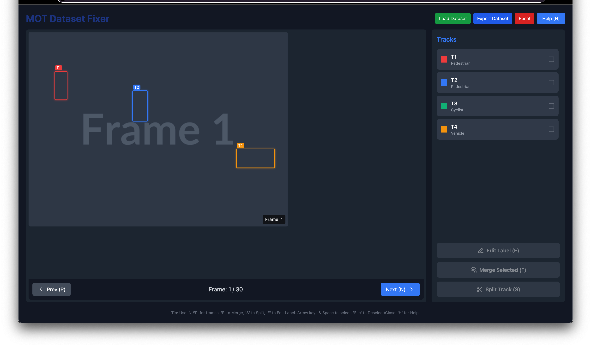
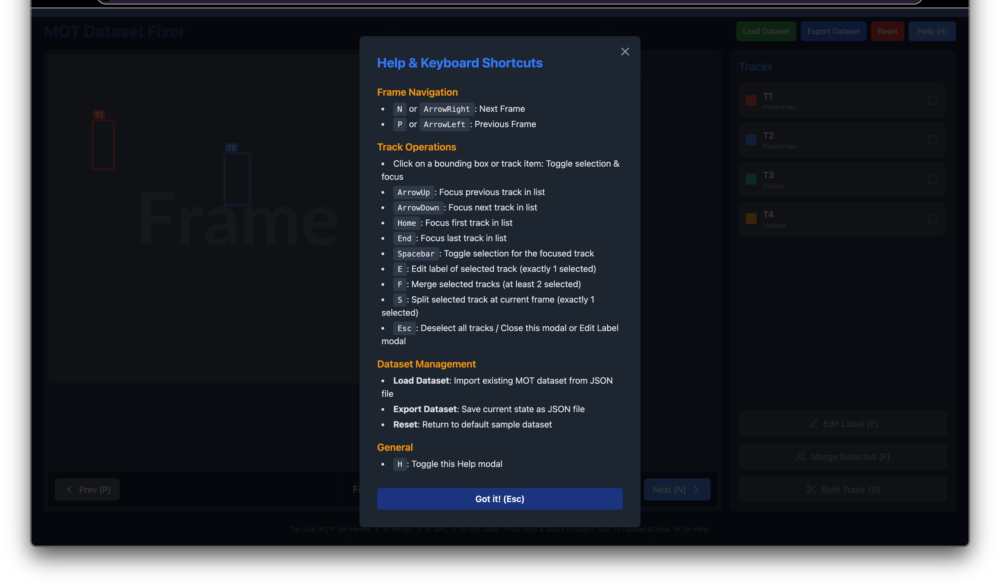
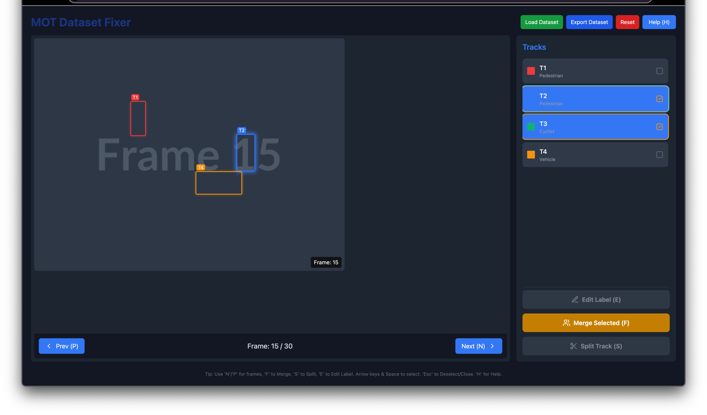

# MOT Dataset Fixer

** Vibe coded with AI. For demonstration purposes. **

A tool for correcting and merging tracks in Multiple Object Tracking (MOT) datasets, specifically designed for automotive scenarios focusing on pedestrians. This interactive application allows users to visualize tracks across frames and merge broken tracks with intuitive keyboard shortcuts.

## Features

- **Frame-by-frame visualization** of tracking data with bounding boxes
- **Track management** - merge, split, and edit tracks
- **Interactive selection** of tracks with color-coded visualization
- **Dataset loading and export** - Import existing datasets and export corrections
- **Keyboard shortcuts** for efficient navigation and editing
- **Label editing** capabilities for track annotations
- **Real-time preview** of changes before applying
- **Export functionality** for corrected datasets

## Screenshots





*Main interface showing frame visualization, track panel, and controls*

## Use Cases

- **Fixing broken tracks** - Merge track fragments that belong to the same object
- **Correcting ID switches** - Handle cases where tracking algorithms assign wrong IDs
- **Dataset validation** - Review and verify tracking accuracy
- **Annotation refinement** - Edit labels and improve dataset quality
- **Research and development** - Analyze tracking performance and prepare training data

## Technology Stack

- **React 19** with TypeScript
- **Vite** for fast development and building
- **Vitest** for testing
- **Lucide React** for icons
- **CSS3** with modern styling

## Installation

**Prerequisites:** Node.js (version 16 or higher)

1. Clone the repository:
   ```bash
   git clone <repository-url>
   cd mot-dataset-fixer
   ```

2. Install dependencies:
   ```bash
   npm install
   ```

3. Start the development server:
   ```bash
   npm run dev
   ```

4. Open your browser and navigate to `http://localhost:5173`

## Usage

### Dataset Management
- **Load Dataset**: Click "Load Dataset" to import an existing MOT dataset from a JSON file
- **Export Dataset**: Click "Export Dataset" to save your corrections as a JSON file
- **Reset**: Click "Reset" to return to the default sample dataset
- **Sample Format**: Check `sample-dataset.json` for the expected JSON structure

### Navigation
- **Next Frame**: Press `N` or click the "Next" button
- **Previous Frame**: Press `P` or click the "Prev" button
- **Help**: Press `H` to open the help modal

### Track Operations
- **Select Track**: Click on a track in the track panel or on a bounding box
- **Multi-select**: Hold Ctrl/Cmd and click to select multiple tracks
- **Merge Tracks**: Select 2+ tracks and press `M`
- **Split Track**: Select 1 track and press `S` to split from current frame
- **Edit Label**: Right-click on a track or use the edit button

### Keyboard Shortcuts
- `N` - Next frame
- `P` - Previous frame  
- `M` - Merge selected tracks
- `S` - Split selected track at current frame
- `H` - Show/hide help
- `Escape` - Clear selection

## Project Structure

```
mot-dataset-fixer/
├── components/           # React components
│   ├── Controls.tsx     # Frame navigation controls
│   ├── FrameDisplay.tsx # Main visualization area
│   ├── TrackPanel.tsx   # Track list and selection
│   ├── HelpModal.tsx    # Help documentation
│   └── EditLabelModal.tsx # Label editing interface
├── src/
│   └── setupTests.ts    # Test configuration
├── App.tsx              # Main application component
├── types.ts             # TypeScript type definitions
├── constants.ts         # Application constants
└── README.md           # This file
```

## Data Format

The application works with detection and track data structures:

```typescript
interface Detection {
  id: string;        // Unique detection ID
  trackId: string;   // Associated track ID
  box: BoundingBox;  // Bounding box coordinates (percentages)
  label: string;     // Object label
  frame: number;     // Frame number
}

interface Track {
  id: string;        // Unique track ID
  label: string;     // Track label
  color: string;     // Display color
}
```

### Dataset JSON Format

The application expects JSON files with the following structure:

```json
{
  "tracks": [
    {
      "id": "T1",
      "label": "Pedestrian", 
      "color": "#EF4444"
    }
  ],
  "detections": [
    {
      "id": "T1_F0",
      "trackId": "T1",
      "box": {
        "x": 10,    // x position (percentage)
        "y": 20,    // y position (percentage) 
        "w": 5,     // width (percentage)
        "h": 15     // height (percentage)
      },
      "label": "Pedestrian",
      "frame": 0
    }
  ],
  "metadata": {
    "description": "Optional metadata",
    "totalFrames": 30,
    "version": "1.0"
  }
}
```

**Important Notes:**
- Bounding box coordinates are in percentages (0-100)
- Frame numbers start from 0
- Track IDs should be unique
- Detection IDs should be unique
- Each detection must reference an existing track ID

## Development

### Available Scripts

- `npm run dev` - Start development server
- `npm run build` - Build for production
- `npm run preview` - Preview production build
- `npm run test` - Run tests
- `npm run test:ui` - Run tests with UI

### Testing

The project uses Vitest for testing with React Testing Library:

```bash
npm run test        # Run tests once
npm run test:ui     # Run tests with interactive UI
```

## Contributing

1. Fork the repository
2. Create a feature branch (`git checkout -b feature/amazing-feature`)
3. Make your changes
4. Add tests for new functionality
5. Commit your changes (`git commit -m 'Add amazing feature'`)
6. Push to the branch (`git push origin feature/amazing-feature`)
7. Open a Pull Request

## License

This project is licensed under the MIT License - see the [LICENSE](LICENSE) file for details.

## Acknowledgments

- Built for automotive computer vision research
- Designed to improve MOT dataset quality
- Inspired by the need for efficient manual annotation tools

## Limitations
- Demo dataset is limited in size and complexity
- May not support all MOT dataset formats
- Designed for interactive use, not batch processing
